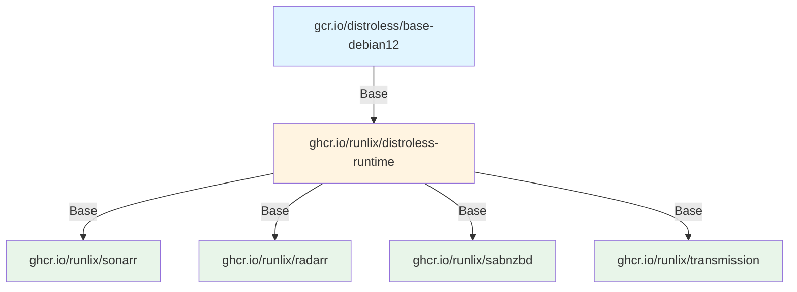
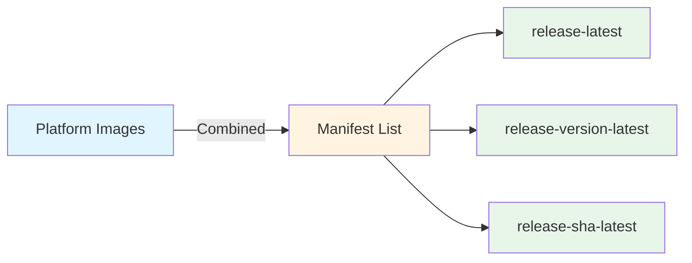
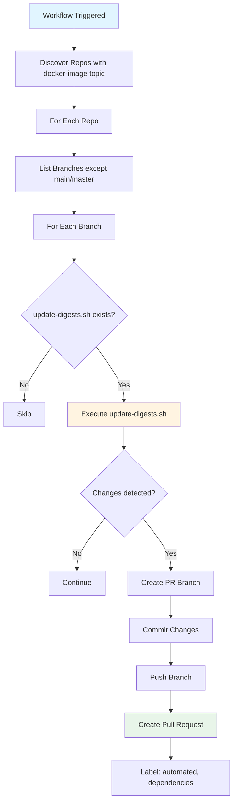
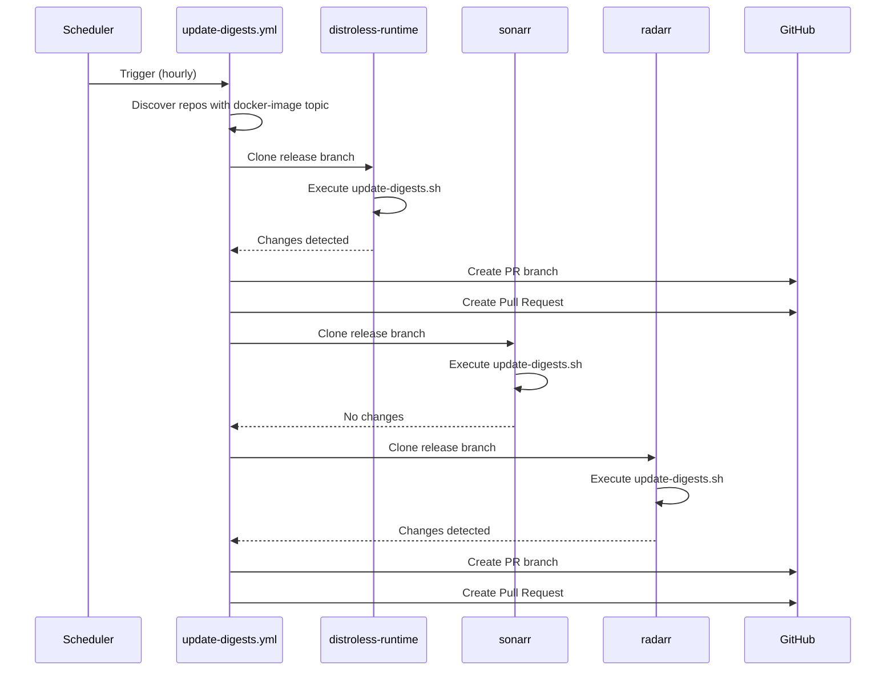

# Runlix CI/CD Pipeline Documentation

Complete guide to the Runlix Docker image build system, covering CI triggers, workflow stages, versioning strategies, and automated maintenance.

## Table of Contents

1. [Architecture Overview](#architecture-overview)
2. [CI Trigger Mechanisms](#ci-trigger-mechanisms)
3. [Workflow Stages](#workflow-stages)
4. [Base Image Maintenance](#base-image-maintenance)
5. [Application Image Maintenance](#application-image-maintenance)
6. [VERSION.json Structure](#versionjson-structure)
7. [Image Tagging Strategy](#image-tagging-strategy)
8. [Automated Maintenance Workflows](#automated-maintenance-workflows)
9. [Quick Reference](#quick-reference)
10. [Troubleshooting](#troubleshooting)

---

## Architecture Overview

The Runlix build system uses a centralized workflow repository (`build-workflow`) that contains reusable GitHub Actions workflows. Individual service repositories call these workflows to build and publish Docker images.

### Repository Structure

```
runlix/
├── build-workflow/              # Centralized reusable workflows
│   ├── .github/workflows/
│   │   ├── on-pr.yml           # PR testing workflow
│   │   ├── on-merge.yml        # Build and publish workflow
│   │   ├── update-digests.yml  # Automated digest updates
│   │   └── update-versions.yml # Automated version updates
│   └── README.md
│
├── distroless-runtime/         # Base image (foundation)
│   ├── linux-amd64.Dockerfile
│   ├── linux-arm64.Dockerfile
│   ├── VERSION.json
│   ├── update-digests.sh
│   └── .github/workflows/
│       ├── on-pr.yml           # Calls build-workflow/on-pr.yml
│       └── on-merge.yml        # Calls build-workflow/on-merge.yml
│
└── [service-repos]/            # Application images
    ├── sonarr/
    ├── radarr/
    ├── sabnzbd/
    └── transmission/
    │   ├── linux-amd64.Dockerfile
    │   ├── linux-arm64.Dockerfile
    │   ├── VERSION.json
    │   ├── update-digests.sh   # Updates base image digests
    │   ├── update-versions.sh   # Updates application versions
    │   └── .github/workflows/
    │       ├── on-pr.yml
    │       └── on-merge.yml
```

### Image Dependency Chain



### Multi-Platform and Multi-Variant Support

- **Platforms**: `linux-amd64`, `linux-arm64`
- **Variants**: `latest` (production), `debug` (with debugging tools)
- Each platform-variant combination is a separate build target in `VERSION.json`

---

## CI Trigger Mechanisms

### Pull Request Workflow

**Location**: `.github/workflows/on-pr.yml` in each service repository

**Trigger Conditions**:
- **Events**: `pull_request` with types: `opened`, `reopened`, `synchronize`
- **Target Branch**: `release` (configurable per repo)
- **Path Filters**: Only triggers when these files change:
  - `linux-amd64.Dockerfile`
  - `linux-arm64.Dockerfile`
  - `VERSION.json`

**Example Trigger**:
```yaml
on:
  pull_request:
    branches:
      - release
    types:
      - opened
      - reopened
      - synchronize
    paths:
      - linux-amd64.Dockerfile
      - linux-arm64.Dockerfile
      - VERSION.json
```

**What It Does**:
- Calls reusable workflow: `runlix/build-workflow/.github/workflows/on-pr.yml@main`
- Builds images without pushing (local testing)
- Runs smoke tests to validate containers
- Pushes PR-specific images if tests pass (tagged with PR SHA for review)

### Merge Workflow

**Location**: `.github/workflows/on-merge.yml` in each service repository

**Trigger Conditions**:
- **Event**: `push` to `release` branch
- **Path Filters**: Only triggers when these files change:
  - `linux-amd64.Dockerfile`
  - `linux-arm64.Dockerfile`
  - `VERSION.json`

**Example Trigger**:
```yaml
on:
  push:
    branches:
      - release
    paths:
      - linux-amd64.Dockerfile
      - linux-arm64.Dockerfile
      - VERSION.json
```

**What It Does**:
- Calls reusable workflow: `runlix/build-workflow/.github/workflows/on-merge.yml@main`
- Builds and publishes images to GitHub Container Registry
- Creates manifest lists for multi-platform support
- Updates `tags.json` with build metadata
- Creates git tags for version changes

---

## Workflow Stages

### PR Workflow Stages (`on-pr.yml`)

#### 1. prepare-version

**Purpose**: Extract metadata and prepare build matrix

**Actions**:
- Checks out repository and build-workflow
- Extracts metadata from `VERSION.json`:
  - `version`: Application or base image version
  - `build_date`: ISO 8601 timestamp
  - `test_url`: Optional health endpoint URL
- Builds build matrix from enabled targets (`enabled: true`)
- Extracts unique variants for manifest list creation

**Outputs**:
- `version`, `build_date`, `branch`, `sha`, `sha_short`
- `target_branch`: PR target branch
- `variants`: Unique variant names
- `matrix`: JSON array of enabled targets
- `test_url`: Health endpoint URL (if provided)

#### 2. test

**Purpose**: Build and test images for each enabled target

**Strategy**: Matrix build (one job per enabled target)

**Actions** (per target):
1. **Setup Docker**: Configures Docker Buildx with QEMU for multi-platform
2. **Generate Metadata**: Creates image tags and platform identifiers
3. **Prepare Build Args**: Extracts build arguments from target configuration:
   - `BUILDER_TAG`, `BUILDER_DIGEST`
   - `BASE_TAG`, `BASE_DIGEST`
   - `PACKAGE_URL` (for application images)
   - `VERSION`, `BUILD_DATE`, `GIT_COMMIT`
4. **Build Image**: Builds Docker image without pushing
   - Uses architecture-specific Dockerfile
   - Pins base images by digest
   - Uses GitHub Actions cache for faster builds
5. **Smoke Test**: Validates container functionality:
   - Starts container and waits for initialization
   - Captures container logs
   - Verifies container is running
   - Optionally tests health endpoint (if `test_url` provided)
   - Uploads test logs as artifacts
6. **Push PR Image**: If tests pass, pushes image with PR-specific tag:
   - Format: `{target_branch}-{version}-{target.name}-pr-{sha_short}`
   - Example: `release-4.0.16.2944-amd64-latest-pr-a1b2c3d`

**Conditional**: Only runs if `run_smoke_test` input is `true` (default)

#### 3. auto-merge

**Purpose**: Automatically merge PR if tests pass

**Actions**:
- Checks if all test jobs succeeded
- Uses GitHub App authentication to merge PR
- Optionally deletes source branch after merge

**Conditional**: Only runs if PR target branch is specified and all tests pass

### Merge Workflow Stages (`on-merge.yml`)

#### 1. prepare-version

**Purpose**: Extract metadata and check for existing PR images

**Actions**:
- Checks out repository and build-workflow
- Extracts metadata from `VERSION.json`
- Checks if commit is from a merged PR
- Extracts PR head SHA for image lookup
- Checks if PR images exist in registry (to avoid rebuild)
- Checks if version changed (for git tagging)

**Outputs**:
- All metadata from PR workflow
- `pr_images_found`: Whether PR images exist for re-tagging
- `version_changed`: Whether version changed in this commit
- `pr_head_sha_short`: Short SHA of PR head commit

#### 2. re-tag (Conditional)

**Purpose**: Re-tag existing PR images with release tags (optimization)

**Condition**: Runs only if `pr_images_found == 'true'`

**Strategy**: Matrix build (one job per enabled target)

**Actions** (per target):
- Checks if PR image exists: `{branch}-{version}-{target.name}-pr-{pr_head_sha_short}`
- Creates new tag: `{branch}-{version}-{target.name}`
- Copies image manifest to new tag (no rebuild needed)

**Benefit**: Saves build time and resources when PR images already exist

#### 3. build-and-test (Conditional)

**Purpose**: Build and test images if PR images don't exist

**Condition**: Runs only if `pr_images_found == 'false'`

**Strategy**: Matrix build (one job per enabled target)

**Actions** (per target):
1. **Setup Docker**: Same as PR workflow
2. **Generate Metadata**: Creates release image tags
3. **Prepare Build Args**: Extracts from target configuration
4. **Build Image**: Builds Docker image (loads locally, doesn't push yet)
5. **Smoke Test**: Same validation as PR workflow
6. **Push Image**: Pushes platform-specific image:
   - Format: `{branch}-{version}-{target.name}`
   - Example: `release-4.0.16.2944-amd64-latest`

**Conditional**: Smoke test only runs if `run_smoke_test` input is `true`

#### 4. publish

**Purpose**: Create manifest lists and update metadata

**Dependencies**: Waits for `re-tag` OR `build-and-test` to complete

**Actions**:
1. **Create Manifest Lists**: For each variant:
   - Collects all platform-specific images for the variant
   - Creates manifest list combining all platforms
   - Creates three tags per variant:
     - `{branch}-{variant}` (e.g., `release-latest`)
     - `{branch}-{version}-{variant}` (e.g., `release-4.0.16.2944-latest`)
     - `{branch}-{sha}-{variant}` (e.g., `release-9e4b4f2-latest`)
2. **Update tags.json**: Updates metadata in default branch:
   - Checks out default branch (usually `main`)
   - Updates or creates `tags.json` with build information
   - Commits and pushes changes (with `[skip ci]` to avoid loops)

**Manifest List Creation**:
```bash
# For each variant, collect platform images
PLATFORM_IMAGES=(
  "ghcr.io/runlix/sonarr:release-4.0.16.2944-amd64-latest"
  "ghcr.io/runlix/sonarr:release-4.0.16.2944-arm64-latest"
)

# Create manifest list
docker buildx imagetools create \
  --tag "ghcr.io/runlix/sonarr:release-latest" \
  "${PLATFORM_IMAGES[@]}"
```

#### 5. create-tag

**Purpose**: Create git tag when version changes

**Condition**: Runs only if `version_changed == 'true'` and publish succeeded

**Actions**:
- Checks out repository at the commit SHA
- Creates git tag: `v{version}`
- Example: `v4.0.16.2944` or `v2025.12.30.1`
- Pushes tag to repository

---

## Base Image Maintenance

### distroless-runtime

The `distroless-runtime` repository provides the base image for all application images. It extends Google's distroless base with essential runtime libraries.

### Versioning Strategy

**Format**: Date-based versioning (`YYYY.MM.DD.n`)

- **YYYY.MM.DD**: Current date
- **n**: Increment number (starts at 1 each day, increments on each change)

**Examples**:
- First change on 2025-12-30: `2025.12.30.1`
- Second change same day: `2025.12.30.2`
- First change next day: `2025.12.31.1`

**When Version Bumps**:
- When `builder.digest` changes (Debian bookworm-slim updates)
- When `base.digest` changes (gcr.io/distroless/base-debian12 updates)

### Update Process

#### Manual Update

Run `update-digests.sh` locally:

```bash
cd distroless-runtime
./update-digests.sh
```

**What It Does**:
1. Reads current `VERSION.json`
2. For each target in `targets[]`:
   - Queries registry for latest `builder.digest` (Debian bookworm-slim)
   - Queries registry for latest `base.digest` (distroless base)
   - Compares with current digests
3. If any digest changed:
   - Updates `VERSION.json` with new digests
   - Bumps version (date-based increment)
   - Updates `build_date` timestamp
4. Writes updated `VERSION.json`

#### Automated Update

**Workflow**: `build-workflow/.github/workflows/update-digests.yml`

**Schedule**: Runs hourly (`0 0 * * *`) or manual dispatch

**Process**:
1. Discovers all repositories with `docker-image` topic
2. For each repository:
   - Lists all branches (except `main`/`master`)
   - For each branch:
     - Clones repository
     - Checks if `update-digests.sh` exists
     - Executes script
     - If changes detected:
       - Creates new branch: `update-digests-{run_id}-{timestamp}`
       - Commits changes
       - Creates Pull Request with labels: `automated`, `dependencies`

**PR Example**:
- Title: "update-digests"
- Body: "Automated digest update for branch `release`"
- Base: `release`
- Head: `update-digests-1234567890-1704067200`

### Dockerfile Structure

**Architecture-Specific Files**:
- `linux-amd64.Dockerfile`: AMD64-specific build
- `linux-arm64.Dockerfile`: ARM64-specific build

**Multi-Stage Build**:

```dockerfile
# STAGE 1: Builder (Debian)
FROM docker.io/library/debian:bookworm-slim@sha256:... AS runtime-deps
RUN apt-get update && apt-get install -y \
    libc6 libssl3 libicu72 ca-certificates tzdata

# STAGE 2: Final (Distroless)
FROM gcr.io/distroless/base-debian12:latest-amd64@sha256:...
COPY --from=runtime-deps /lib/x86_64-linux-gnu /lib/x86_64-linux-gnu
COPY --from=runtime-deps /usr/lib/x86_64-linux-gnu /usr/lib/x86_64-linux-gnu
COPY --from=runtime-deps /etc/ssl/certs /etc/ssl/certs
COPY --from=runtime-deps /usr/share/zoneinfo /usr/share/zoneinfo
```

**Key Features**:
- Hardcoded architecture values (no conditionals)
- Digest pinning for reproducibility
- Minimal final image (distroless)
- Essential runtime libraries only

### Image Tags Created

**Platform-Specific Images**:
- Format: `release-{version}-linux-{arch}-{variant}`
- Example: `release-2025.12.30.1-linux-amd64-latest`

**Manifest Lists** (per variant):
- `release-{variant}`: `release-latest`, `release-debug`
- `release-{version}-{variant}`: `release-2025.12.30.1-latest`
- `release-{sha}-{variant}`: `release-9e4b4f2-latest`

---

## Application Image Maintenance

### Services

- **sonarr**: TV show collection manager
- **radarr**: Movie collection manager
- **sabnzbd**: Usenet downloader
- **transmission**: BitTorrent client

All services use `distroless-runtime` as their base image.

### Versioning Strategy

**Format**: Semantic versioning (application-specific)

**Examples**:
- Sonarr: `4.0.16.2944`
- Radarr: `6.0.4.10291`
- SABnzbd: `4.5.5`
- Transmission: `4.0.6`

**Version Preservation**:
- Application version is preserved from upstream releases
- When base image digests change, only `build_date` updates
- Version only changes when application releases new version

### Update Scripts

#### update-digests.sh

**Purpose**: Update base image and builder digests

**What It Does**:
1. Reads current `VERSION.json`
2. For each target:
   - Queries registry for latest `builder.digest` (Debian)
   - Queries registry for latest `base.digest` (distroless-runtime)
   - Updates digests if changed
3. If any digest changed:
   - Updates `build_date` timestamp
   - **Does NOT change application version**

**Key Difference from Base Image**:
- Base image: Bumps version when digests change
- Application images: Only updates `build_date`, preserves version

#### update-versions.sh

**Purpose**: Update application version and package URLs

**Service-Specific**: Each service queries its own release API

**What It Does**:
1. Queries application release API:
   - Sonarr: `https://services.sonarr.tv/v1/releases`
   - Radarr: Similar API endpoint
   - SABnzbd: GitHub releases API
   - Transmission: GitHub releases API
2. Extracts latest version and branch
3. Extracts package URLs for each architecture:
   - `linux-amd64`: x64/amd64 package URL
   - `linux-arm64`: arm64 package URL
4. Updates `VERSION.json`:
   - Updates root `version` field
   - Updates `sbranch` (source branch)
   - Updates `package_url` for each target
   - Updates `build_date` if version changed

**Example (Sonarr)**:
```bash
# Query API
response=$(curl -fsSL "https://services.sonarr.tv/v1/releases" | jq '.["v4-stable"]')

# Extract version and URLs
version=$(echo "$response" | jq -r .version)
amd64_url=$(echo "$response" | jq -r '.linux.x64.archive.url')
arm64_url=$(echo "$response" | jq -r '.linux.arm64.archive.url')

# Update VERSION.json
jq --arg v "$version" \
   --arg amd64 "$amd64_url" \
   --arg arm64 "$arm64_url" \
   '.version = $v | 
    .targets[0].package_url = $amd64 |
    .targets[2].package_url = $arm64' \
   VERSION.json
```

### Automated Workflows

#### update-digests.yml

**Location**: `build-workflow/.github/workflows/update-digests.yml`

**Schedule**: Hourly (`0 0 * * *`) or manual dispatch

**Process**:
1. Discovers repos with `docker-image` topic
2. For each repo and branch:
   - Executes `update-digests.sh`
   - Creates PR if changes detected

#### update-versions.yml

**Location**: `build-workflow/.github/workflows/update-versions.yml`

**Schedule**: Daily (`0 0 * * *`) or manual dispatch

**Process**:
1. Discovers repos with `docker-image` topic
2. For each repo and branch:
   - Executes `update-versions.sh` (if exists)
   - Creates PR if changes detected

**Note**: Not all services have `update-versions.sh` (only those with automated version checking)

### Dockerfile Structure

**Architecture-Specific Files**:
- `linux-amd64.Dockerfile`: AMD64-specific build
- `linux-arm64.Dockerfile`: ARM64-specific build

**Multi-Stage Build Pattern**:

```dockerfile
# STAGE 1: Fetch application binaries
FROM docker.io/library/debian:bookworm-slim@sha256:... AS fetch
ARG PACKAGE_URL
WORKDIR /app
RUN apt-get update && apt-get install -y curl tar \
 && curl -L -f "${PACKAGE_URL}" -o app.tar.gz \
 && tar -xzf app.tar.gz -C /app/bin --strip-components=1

# STAGE 2: Install application dependencies
FROM docker.io/library/debian:bookworm-slim@sha256:... AS app-deps
RUN apt-get update && apt-get install -y \
    sqlite3 ffmpeg mediainfo  # Service-specific deps

# STAGE 3: Final image (distroless-runtime)
FROM ghcr.io/runlix/distroless-runtime:release-2025.12.29.1-linux-amd64-latest@sha256:...
COPY --from=fetch /app /app
COPY --from=app-deps /usr/bin/sqlite3 /usr/bin/sqlite3
COPY --from=app-deps /usr/lib/x86_64-linux-gnu/libsqlite3.so.* /usr/lib/x86_64-linux-gnu/
# ... more library copies
WORKDIR /app/bin
USER 65532:65532
ENTRYPOINT ["/app/bin/Sonarr", "-nobrowser", "-data=/config"]
```

**Key Features**:
- Uses `distroless-runtime` as base (by digest)
- Downloads application binaries from `package_url`
- Copies only necessary binaries and libraries
- Minimal final image size
- Non-root user (65532:65532)

### Image Tags Created

**Platform-Specific Images**:
- Format: `{branch}-{version}-{target.name}`
- Example: `release-4.0.16.2944-amd64-latest`

**Manifest Lists** (per variant):
- `{branch}-{variant}`: `release-latest`, `release-debug`
- `{branch}-{version}-{variant}`: `release-4.0.16.2944-latest`
- `{branch}-{sha}-{variant}`: `release-9e4b4f2-latest`

---

## VERSION.json Structure

### Base Image Format

**Location**: `distroless-runtime/VERSION.json`

```json
{
  "version": "2025.12.30.1",
  "build_date": "2025-12-30T16:20:41Z",
  "sbranch": "main",
  "targets": [
    {
      "arch": "linux-amd64",
      "variant": "latest",
      "enabled": true,
      "name": "linux-amd64-latest",
      "dockerfile": "linux-amd64.Dockerfile",
      "base": {
        "image": "gcr.io/distroless/base-debian12",
        "tag": "latest-amd64",
        "digest": "sha256:7aa57dbe6daf724d489941dde747932bfbba936b317b021ec7b8362ed5742987"
      },
      "builder": {
        "image": "docker.io/library/debian",
        "tag": "bookworm-slim",
        "digest": "sha256:a1363ada3b45cb3ebc74c78943558f8b0c2b59aaa194d8224e1b02cfd5d78583"
      },
      "tags": []
    }
  ]
}
```

### Application Image Format

**Location**: `{service}/VERSION.json` (e.g., `sonarr/VERSION.json`)

```json
{
  "version": "4.0.16.2944",
  "build_date": "2026-01-01T07:57:02Z",
  "sbranch": "main",
  "test_url": "http://localhost:8989",
  "targets": [
    {
      "arch": "linux-amd64",
      "variant": "latest",
      "enabled": true,
      "name": "amd64-latest",
      "dockerfile": "linux-amd64.Dockerfile",
      "package_url": "https://github.com/Sonarr/Sonarr/releases/download/v4.0.16.2944/Sonarr.main.4.0.16.2944.linux-x64.tar.gz",
      "base": {
        "image": "ghcr.io/runlix/distroless-runtime",
        "tag": "release-2025.12.29.1-linux-amd64-latest",
        "digest": "sha256:84c0f7bdb233bd276f4aecd7cef9109990a19c71579feb508021c9b86407a20f"
      },
      "builder": {
        "image": "docker.io/library/debian",
        "tag": "bookworm-slim",
        "digest": "sha256:a1363ada3b45cb3ebc74c78943558f8b0c2b59aaa194d8224e1b02cfd5d78583"
      },
      "tags": []
    }
  ]
}
```

### Field Descriptions

#### Root Level Fields

- **`version`**: Version string (date-based for base, semantic for apps)
- **`build_date`**: ISO 8601 timestamp (UTC)
- **`sbranch`**: Source branch (optional, for tracking)
- **`test_url`**: Optional health endpoint URL for smoke tests (application images only)

#### Target Fields

- **`arch`**: Architecture (`linux-amd64`, `linux-arm64`)
- **`variant`**: Variant name (`latest`, `debug`)
- **`enabled`**: Boolean to enable/disable this target (only enabled targets are built)
- **`name`**: Unique target identifier (typically `{arch}-{variant}` or `linux-{arch}-{variant}`)
- **`dockerfile`**: Path to architecture-specific Dockerfile
- **`package_url`**: Download URL for application binaries (application images only, per target)
- **`base`**: Base image information
  - **`image`**: Base image repository
  - **`tag`**: Base image tag
  - **`digest`**: Base image digest (pinned for reproducibility)
- **`builder`**: Builder image information (for multi-stage builds)
  - **`image`**: Builder image repository
  - **`tag`**: Builder image tag
  - **`digest`**: Builder image digest (pinned)
- **`tags`**: Additional tags array (currently unused, reserved for future)

---

## Image Tagging Strategy

### Platform-Specific Images

Each build target produces a platform-specific image with a unique tag.

**Format**: `{branch}-{version}-{target.name}`

**Examples**:
- `release-4.0.16.2944-amd64-latest`
- `release-4.0.16.2944-arm64-latest`
- `release-2025.12.30.1-linux-amd64-latest`
- `release-2025.12.30.1-linux-arm64-debug`

**Registry**: `ghcr.io/runlix/{repository-name}`

**Full Image Reference**:
```
ghcr.io/runlix/sonarr:release-4.0.16.2944-amd64-latest
ghcr.io/runlix/distroless-runtime:release-2025.12.30.1-linux-amd64-latest
```

### Manifest Lists

After all platform-specific images are built, manifest lists are created per variant, combining all platforms.

**Tags Created** (per variant):

1. **`{branch}-{variant}`**: Latest for variant
   - Example: `release-latest`, `release-debug`
   - Points to most recent build for the variant
   - Users can pull this tag and Docker automatically selects correct platform

2. **`{branch}-{version}-{variant}`**: Version-specific
   - Example: `release-4.0.16.2944-latest`, `release-2025.12.30.1-debug`
   - Points to specific version
   - Useful for pinning to a version

3. **`{branch}-{sha}-{variant}`**: Commit-specific
   - Example: `release-9e4b4f2-latest`
   - Points to specific commit
   - Useful for debugging or referencing exact build

**Manifest List Creation**:

```bash
# Collect platform images for variant
PLATFORM_IMAGES=(
  "ghcr.io/runlix/sonarr:release-4.0.16.2944-amd64-latest"
  "ghcr.io/runlix/sonarr:release-4.0.16.2944-arm64-latest"
)

# Create primary manifest list
docker buildx imagetools create \
  --tag "ghcr.io/runlix/sonarr:release-latest" \
  "${PLATFORM_IMAGES[@]}"

# Create alias tags (more efficient than separate manifests)
docker buildx imagetools create \
  --tag "ghcr.io/runlix/sonarr:release-4.0.16.2944-latest" \
  "ghcr.io/runlix/sonarr:release-latest"

docker buildx imagetools create \
  --tag "ghcr.io/runlix/sonarr:release-9e4b4f2-latest" \
  "ghcr.io/runlix/sonarr:release-latest"
```

### Pulling Images

**Multi-Platform Manifest List** (recommended):
```bash
# Docker automatically selects correct platform
docker pull ghcr.io/runlix/sonarr:release-latest

# Or version-specific
docker pull ghcr.io/runlix/sonarr:release-4.0.16.2944-latest
```

**Platform-Specific** (if needed):
```bash
# Explicitly pull platform-specific image
docker pull ghcr.io/runlix/sonarr:release-4.0.16.2944-amd64-latest
```

### Tag Lifecycle



---

## Automated Maintenance Workflows

### update-digests.yml

**Location**: `build-workflow/.github/workflows/update-digests.yml`

**Purpose**: Automatically update base image and builder digests across all repositories

**Triggers**:
- **Schedule**: Hourly (`0 0 * * *` - runs at minute 0 of every hour)
- **Manual**: `workflow_dispatch`

**Process**:



**Repository Discovery**:
```bash
# Finds all repos with docker-image topic
REPOSITORIES=$(gh repo list "$OWNER" --limit 200 \
  --json name,repositoryTopics \
  --jq '.[] | select([.repositoryTopics[]?.name] | index("docker-image")) | .name')
```

**Branch Processing**:
- Processes all branches except `main` and `master`
- Creates PR branch: `update-digests-{run_id}-{timestamp}`
- PR base: The branch being updated (e.g., `release`)

**PR Creation**:
- **Title**: "update-digests"
- **Body**: "Automated digest update for branch `{branch}`"
- **Labels**: `automated`, `dependencies`
- **Commit Message**: "Upstream image update" (or "Upstream image update [skip ci]" for `pr` branch)

**Concurrency**:
- Uses workflow-level concurrency
- Only one instance runs at a time (`cancel-in-progress: false`)

### update-versions.yml

**Location**: `build-workflow/.github/workflows/update-versions.yml`

**Purpose**: Automatically update application versions and package URLs

**Triggers**:
- **Schedule**: Daily (`0 0 * * *` - runs at midnight UTC)
- **Manual**: `workflow_dispatch`

**Process**: Same as `update-digests.yml`, but executes `update-versions.sh`

**Service-Specific**:
- Only repositories with `update-versions.sh` are processed
- Each service queries its own release API
- Updates version, package URLs, and build_date

**PR Creation**:
- **Title**: "Version update"
- **Body**: "Automated version update for branch `{branch}`"
- **Labels**: `automated`, `dependencies`

### Workflow Flow Diagram



---

## Quick Reference

### Common Operations

#### Check Current Version
```bash
jq -r '.version' VERSION.json
```

#### Check Enabled Targets
```bash
jq '.targets[] | select(.enabled == true) | {arch, variant, name}' VERSION.json
```

#### Update Digests Manually
```bash
cd distroless-runtime  # or any service repo
./update-digests.sh
```

#### Update Application Version Manually
```bash
cd sonarr  # or radarr, sabnzbd, transmission
./update-versions.sh
```

#### Pull Latest Image
```bash
# Multi-platform (recommended)
docker pull ghcr.io/runlix/sonarr:release-latest

# Specific version
docker pull ghcr.io/runlix/sonarr:release-4.0.16.2944-latest

# Platform-specific
docker pull ghcr.io/runlix/sonarr:release-4.0.16.2944-amd64-latest
```

#### Check Image Digest
```bash
docker buildx imagetools inspect ghcr.io/runlix/sonarr:release-latest --raw | jq -r '.manifests[0].digest'
```

#### List All Tags for Repository
```bash
gh api /orgs/runlix/packages/container/{repo-name}/versions --jq '.[].metadata.container.tags[]' | sort -u
```

### Workflow Trigger Conditions

| Workflow | Event | Branch | Path Filters |
|----------|-------|--------|--------------|
| `on-pr.yml` | `pull_request` | `release` | Dockerfiles, VERSION.json |
| `on-merge.yml` | `push` | `release` | Dockerfiles, VERSION.json |
| `update-digests.yml` | `schedule` (hourly) | All (except main/master) | N/A |
| `update-versions.yml` | `schedule` (daily) | All (except main/master) | N/A |

### Version Formats

| Repository Type | Format | Example |
|----------------|--------|---------|
| Base Image | `YYYY.MM.DD.n` | `2025.12.30.1` |
| Application | Semantic | `4.0.16.2944`, `6.0.4.10291` |

### Image Tag Formats

| Tag Type | Format | Example |
|----------|--------|---------|
| Platform-specific | `{branch}-{version}-{target.name}` | `release-4.0.16.2944-amd64-latest` |
| Manifest (latest) | `{branch}-{variant}` | `release-latest` |
| Manifest (version) | `{branch}-{version}-{variant}` | `release-4.0.16.2944-latest` |
| Manifest (commit) | `{branch}-{sha}-{variant}` | `release-9e4b4f2-latest` |

---

## Troubleshooting

### Build Failures

#### Issue: Build fails with "digest not found"

**Cause**: Base image digest in `VERSION.json` is invalid or outdated.

**Solution**:
1. Check if base image exists:
   ```bash
   skopeo inspect docker://ghcr.io/runlix/distroless-runtime:release-2025.12.30.1-linux-amd64-latest
   ```
2. Update digests:
   ```bash
   ./update-digests.sh
   ```
3. Commit and push changes.

#### Issue: Build fails with "package_url not found"

**Cause**: `package_url` in `VERSION.json` is invalid or file was removed.

**Solution**:
1. Verify URL is accessible:
   ```bash
   curl -I https://github.com/Sonarr/Sonarr/releases/download/v4.0.16.2944/...
   ```
2. Update version:
   ```bash
   ./update-versions.sh
   ```

#### Issue: Smoke test fails

**Cause**: Container doesn't start or health endpoint unreachable.

**Solution**:
1. Check test logs in workflow artifacts
2. Verify `test_url` in `VERSION.json` is correct
3. Test locally:
   ```bash
   docker run --rm ghcr.io/runlix/sonarr:release-4.0.16.2944-amd64-latest
   ```

### Version Update Issues

#### Issue: Automated PR not created

**Cause**: Script exited with non-zero code or no changes detected.

**Solution**:
1. Check workflow logs for errors
2. Run script manually:
   ```bash
   ./update-digests.sh
   echo $?  # Should be 0 if changes made
   ```
3. Verify script has execute permission:
   ```bash
   chmod +x update-digests.sh
   ```

#### Issue: Version not bumping correctly

**Cause**: Date format mismatch or increment logic error.

**Solution**:
1. Check current date format:
   ```bash
   date +%Y.%m.%d
   ```
2. Verify version format matches: `YYYY.MM.DD.n`
3. Check script logic in `update-digests.sh`

### Workflow Issues

#### Issue: Workflow not triggering

**Cause**: Path filters not matching or branch name incorrect.

**Solution**:
1. Verify file paths match filters:
   ```yaml
   paths:
     - linux-amd64.Dockerfile
     - linux-arm64.Dockerfile
     - VERSION.json
   ```
2. Check branch name matches trigger:
   ```yaml
   branches:
     - release
   ```
3. Verify workflow file is in `.github/workflows/` directory

#### Issue: PR images not found for re-tagging

**Cause**: PR workflow didn't push images or tag format mismatch.

**Solution**:
1. Check PR workflow completed successfully
2. Verify image exists:
   ```bash
   docker buildx imagetools inspect ghcr.io/runlix/sonarr:release-4.0.16.2944-amd64-latest-pr-a1b2c3d
   ```
3. Check tag format matches expected pattern

### Registry Issues

#### Issue: Cannot push to GHCR

**Cause**: Missing or invalid `GHCR_TOKEN` secret.

**Solution**:
1. Verify secret exists in repository settings
2. Check token has `write:packages` permission
3. Regenerate token if needed

#### Issue: Manifest list creation fails

**Cause**: Platform images not found or registry timeout.

**Solution**:
1. Verify all platform images exist:
   ```bash
   docker buildx imagetools inspect ghcr.io/runlix/sonarr:release-4.0.16.2944-amd64-latest
   docker buildx imagetools inspect ghcr.io/runlix/sonarr:release-4.0.16.2944-arm64-latest
   ```
2. Check workflow retry logic (workflow retries 3 times with 30s delay)
3. Verify network connectivity to GHCR

### Common Error Messages

| Error | Cause | Solution |
|-------|-------|----------|
| `failed to fetch workflow` | Workflow not in `main` branch | Ensure workflow is committed to `main` branch in `build-workflow` repo |
| `digest: required value is missing` | Empty digest in VERSION.json | Run `update-digests.sh` to populate digests |
| `no enabled targets found` | All targets have `enabled: false` | Set at least one target to `enabled: true` |
| `manifest unknown` | Image tag doesn't exist | Verify tag format and image was pushed successfully |

---

## Additional Resources

- [GitHub Actions Documentation](https://docs.github.com/en/actions)
- [Docker Buildx Documentation](https://docs.docker.com/build/buildx/)
- [OCI Image Manifest Specification](https://github.com/opencontainers/image-spec)

---

**Last Updated**: 2026-01-01
**Maintained By**: Runlix Team
